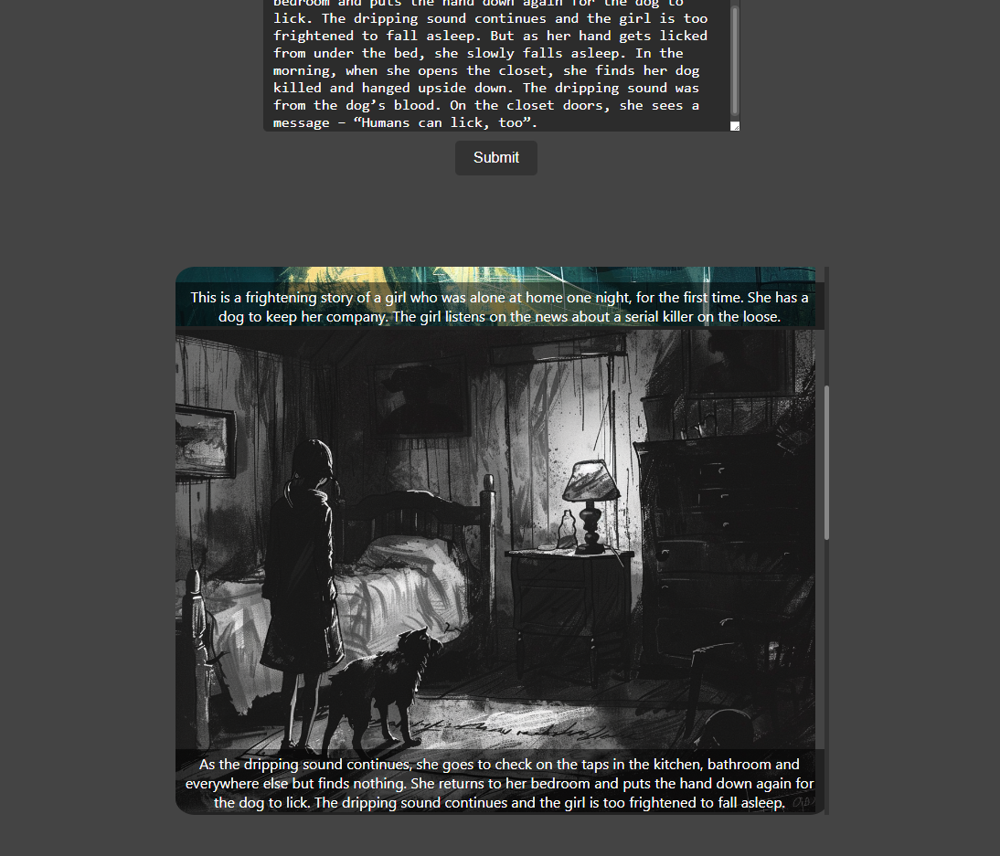

# book-illustartor-api

This is a RESTful API built with Go (Golang) that provides illustration services for any kind of text, by using Midjourney API(https://www.goapi.ai/midjourney-api). The API is designed to handle HTTP requests and responses, and it communicates with the `book-illustrator-srv` service using gRPC.

Features implemented:  
- Generate images for provided text and return array of text with image to show on front end.

Features will be implemented: 
- Create and manage user profile.
- Save generated data on user profile.
- Export PDF file.
- Detailed manage of image generation(variation selection, extra filters).
- User subscription using stripe.